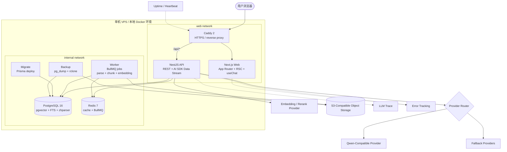

# DevBrain

DevBrain 是一个面向开发者的 self-hostable RAG 知识库。它支持上传技术文档、项目资料和学习笔记，通过混合检索、重排和流式对话生成带引用的回答，帮助用户把分散资料变成可追溯、可验证的问答系统。

本 README 面向公开仓库，只描述公开的产品能力、技术选型和运行方式。

---

## 项目定位

- 面向开发者个人和小团队的知识库工具。
- 重点解决“资料分散、搜索低效、回答缺少出处”的问题。
- P0 目标是形成可本地运行、可部署、可观测、可备份的端到端闭环。
- 默认单机部署，保留后续扩展到独立向量库、集中式监控和更复杂权限模型的接口。

---

## 核心能力

### P0 范围

- **文档上传**：支持 PDF、Markdown、TXT、DOCX；上传走对象存储 presigned PUT；后端校验文件类型和大小。
- **异步处理**：文档解析、切块、embedding 在 worker 中执行，不阻塞 API request path。
- **混合检索**：PostgreSQL FTS + pgvector 语义检索，通过 RRF 融合后接 rerank。
- **流式对话**：兼容 Vercel AI SDK Data Stream Protocol，支持首 token loading、粘底滚动和错误态处理。
- **引用追溯**：回答中使用 `[1][2]` 引用，点击后跳转到原文位置。
- **知识库空间**：支持个人 KB 和团队 KB，团队内提供 Owner / Member 两档角色。
- **拒答机制**：检索分数阈值、system prompt 约束和无足够上下文时的明确拒答。
- **基础工程化**：Docker Compose、CI、部署、监控、错误追踪和备份恢复验证。

### P1 候选

- 代码片段搜索。
- 学习问答模式。
- 评测系统和跑分脚本。
- 多模型对比和用户反馈。
- 源码文件或 git repo ingest。
- 共享对话只读链接。
- PDF、移动端和引用体验优化。

---

## 技术栈

| 层               | 选型                                                | 说明                                                                            |
| ---------------- | --------------------------------------------------- | ------------------------------------------------------------------------------- |
| 前端             | Next.js App Router、React、Tailwind、shadcn/ui      | RSC + Client Components，适合流式 UI 和复杂交互                                 |
| 状态             | TanStack Query、Zustand、URL state                  | 服务端数据和纯 UI 状态分层管理                                                  |
| Markdown         | `react-markdown`、`remark-gfm`、Shiki               | 支持代码块高亮和流式渲染优化                                                    |
| PDF              | `react-pdf` + `customTextRenderer`                  | 支持页码、bbox 和文本高亮                                                       |
| 后端             | NestJS、REST、Streaming                             | 模块化 API 和可测试的服务边界                                                   |
| ORM              | Prisma                                              | schema-first，便于迁移和类型生成                                                |
| 数据库           | PostgreSQL 16 + pgvector + PG FTS + zhparser        | 业务数据、向量和全文检索统一管理                                                |
| 缓存/队列        | Redis 7 + BullMQ                                    | 异步文档处理和任务状态管理                                                      |
| 对象存储         | Cloudflare R2 或 S3 兼容存储                        | 保存原始文件和备份文件                                                          |
| LLM 调用         | LangChain.js、Vercel AI SDK、自研 provider router   | LangChain.js 只做 RAG 工具，AI SDK 负责 streaming，provider router 负责模型路由 |
| Embedding/Rerank | DashScope `text-embedding-v3`、`gte-rerank`         | 初始 provider，可通过抽象层扩展                                                 |
| 鉴权             | Argon2id、JWT access/refresh、token family rotation | refresh token 只存 SHA-256，cookie 使用 HttpOnly/Secure/SameSite                |
| 反向代理         | Caddy 2                                             | 自动 HTTPS，配置简洁                                                            |
| 部署             | Docker Compose、GHCR pull-by-SHA                    | CI 构建镜像，VPS 只拉取镜像并启动                                               |
| 可观测           | Sentry、Langfuse、Better Stack                      | 错误、LLM trace、外部探测和 backup heartbeat                                    |
| 备份             | `pg_dump`、rclone、supercronic                      | 本地保留 + 对象存储异地保留，必须定期 restore-test                              |

---

## 架构图



---

## 关键设计

### 一个 Postgres 承载业务数据、向量和全文检索

P0 使用 PostgreSQL 16 同时承载业务表、pgvector 向量和 PG FTS。这样可以减少基础设施数量，简化备份恢复和权限控制。代码层保留 `VectorStore` 抽象，后续规模增长后可评估迁移到 Milvus 或 Qdrant。

### Hybrid Search + RRF + Rerank

初始检索链路：

1. BM25 召回候选。
2. 向量检索召回候选。
3. RRF 融合两路结果。
4. rerank 重排。
5. 选取最终上下文交给 LLM。

BM25 对 API 名、错误码、函数名等精确关键词更敏感；向量检索对语义相近表达更友好。两者融合后再 rerank，可以在工程复杂度可控的前提下提升回答上下文质量。

### Citation Protocol

```ts
type Citation = {
  id: string;
  documentId: string;
  sourceType: 'pdf' | 'markdown' | 'txt' | 'docx';
  chunkId: string;
  chunkText: string;
  score: number;
  page?: number;
  bbox?: { x: number; y: number; width: number; height: number; unit: 'ratio' };
  headingPath?: string[];
  anchor?: string;
};
```

PDF 使用 `page + bbox` 定位；Markdown、TXT、DOCX 使用 `chunkId + anchor + headingPath` 定位。前端根据 `sourceType` 分发跳转和高亮逻辑。

### LLM 调用边界

- LangChain.js 只用于 RAG pipeline 工具。
- Vercel AI SDK 只负责 Data Stream Protocol 和前端流式消费。
- provider router 由后端自研，集中放在 `apps/api/src/llm`。

### 部署原则

- CI 负责 build 和 push 镜像。
- 运行环境通过 image tag 或 SHA 拉取镜像。
- migration 必须先于 api/web/worker 启动。
- 不在生产 VPS 上执行 Next.js build。
- `.env.production` 只存在于服务器，不提交到仓库。

---

## 项目结构

```text
devbrain/
├── apps/
│   ├── api/                 # NestJS API
│   ├── web/                 # Next.js Web
│   └── worker/              # NestJS Standalone worker
├── infra/
│   ├── backup/              # backup image、backup.sh、crontab
│   └── caddy/               # Caddyfile
├── docs/
│   └── planning/            # 产品需求和开发路线图
├── openspec/                # OpenSpec changes/specs
├── docker-compose.yml
├── .env.example
├── pnpm-workspace.yaml
└── README.md
```

---

## 本地开发

### 前置条件

- Node 22+。
- pnpm 10.x。
- Docker 24+ 和 Docker Compose v2。

### 初始化

```bash
pnpm install
cp .env.example .env
```

### 启动基础依赖

```bash
docker compose up -d postgres redis
```

### 启动开发服务

```bash
pnpm dev
```

默认端口：

- Web: `http://localhost:3000`
- API: `http://localhost:3001`

### 常用命令

```bash
pnpm lint
pnpm typecheck
pnpm test
pnpm format
docker compose config
```

---

## 部署概览

### 环境要求

- 一台可运行 Docker Compose 的 Linux 服务器。
- 一个域名，并将 DNS A 记录指向服务器公网 IP。
- GitHub Actions 可访问 GHCR。
- 服务器上提供 `.env.production`，权限建议设置为 `600`。

### CI/CD 流程

```text
lint + typecheck
  ↓
test
  ↓
build-and-push images
  ↓
deploy by image SHA
  ↓
run migration before app startup
```

### 回滚原则

- 应用回滚通过切换上一版 image tag 或 SHA 完成。
- 数据回滚必须基于经过 restore-test 验证的备份。
- schema 变更需要在 OpenSpec change 中明确 migration 和 rollback 策略。

---

## 运维

### 监控

- Sentry：前后端错误追踪，必须配置敏感字段过滤。
- Langfuse：LLM trace、token、延迟和 provider 调用记录。
- Better Stack：外部 uptime 探测和 backup heartbeat。

### 备份

- 每日执行 `pg_dump -F c`。
- 本地保留短周期备份，对象存储保留长周期备份。
- 首次上线和重要 schema 变更后必须执行 restore-test。
- 备份日志和 heartbeat 不应包含 token、原始私有文档或完整 prompt。

### Secret 管理

- `.env.production` 不进 git。
- GitHub Secrets 只保存部署必需凭证。
- 多环境或多人协作时，评估 Doppler、Infisical 或 Vault。

---

## Roadmap

### P1

- [ ] 代码片段搜索。
- [ ] 学习问答模式。
- [ ] 评测系统。
- [ ] 多模型对比。
- [ ] 用户反馈和反馈整理。
- [ ] 源码文件 / git repo ingest。
- [ ] 共享对话只读链接。
- [ ] PDF 和移动端体验优化。

### P2

- [ ] Prometheus + Grafana metrics。
- [ ] Loki + Promtail 日志聚合。
- [ ] OpenTelemetry + Tempo / Jaeger tracing。
- [ ] 自动 restore-test。
- [ ] 双地点异地备份。
- [ ] Secret manager。
- [ ] Cloudflare Tunnel。
- [ ] Milvus / Qdrant 向量库迁移。

---

## License

MIT
