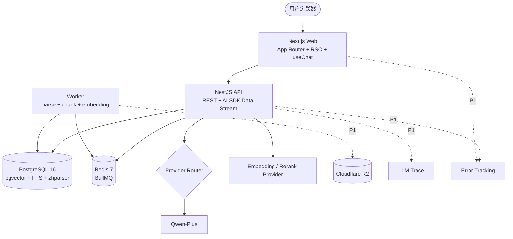

# DevBrain

DevBrain 是一个面向开发者的 self-hostable RAG 知识库。它支持上传技术文档、项目资料和学习笔记，通过混合检索、重排和流式对话生成带引用的回答，帮助用户把分散资料变成可追溯、可验证的问答系统。

本 README 面向公开仓库，只描述公开的产品能力、技术选型和运行方式。更完整的阶段边界见 `docs/planning/devbrain-prd.md` 和 `docs/planning/development-roadmap.md`。

---

## 项目定位

- 面向开发者个人和小团队的知识库工具。
- 重点解决“资料分散、搜索低效、回答缺少出处”的问题。
- P0 目标是形成最小可用 RAG 闭环：注册/登录、个人 KB、Markdown 上传、worker 处理、真实检索/生成、流式对话和文本引用定位。
- P1 再补产品化能力、部署运维能力和真实反馈触发的增强功能。

---

## 核心能力

### P0 范围

- **注册/登录**：支持账号注册、登录、退出、JWT access/refresh 和 token family rotation。
- **空状态**：新用户登录后看到可操作空状态，可以直接创建第一个 KB。
- **个人 KB**：支持 personal space 下的 KB 创建、列表、详情和权限校验。
- **Markdown 上传**：支持上传 Markdown 文档，进入 Document 状态机。
- **Worker ready**：文档解析、切块、embedding 在 worker 中执行，不阻塞 API request path。
- **真实检索/生成**：PostgreSQL FTS + pgvector 召回，通过 RRF 融合和 DashScope rerank 后调用真实 LLM。
- **Chat streaming**：兼容 Vercel AI SDK Data Stream Protocol，返回流式回答。
- **文本 citation 定位**：回答中使用引用，点击后定位到 Markdown chunk anchor 或 source panel。

### P1 候选

- 产品化补齐：找回密码、team、多格式文档、完整文档管理、模型设置、完整会话管理。
- 上线与反馈前置：CI/GHCR、VPS 部署、监控、备份、反馈入口和反馈整理。
- 反馈触发增强：评测、代码搜索、面试题模式、多模型对比、repo ingest、共享链接、PDF/移动端优化等。
- 完整 P1 候选以 `docs/planning/devbrain-prd.md` 为准，README 只保留公开概览。

---

## 技术栈

| 层               | 选型                                                | 说明                                                                            |
| ---------------- | --------------------------------------------------- | ------------------------------------------------------------------------------- |
| 前端             | Next.js App Router、React、Tailwind、shadcn/ui      | RSC + Client Components，适合流式 UI 和复杂交互                                 |
| 状态             | TanStack Query、Zustand、URL state                  | 服务端数据和纯 UI 状态分层管理                                                  |
| Markdown         | `react-markdown`、`remark-gfm`、Shiki               | 支持代码块高亮和流式渲染优化                                                    |
| PDF              | `react-pdf` + `customTextRenderer`                  | P1 使用，支持页码、bbox 和文本高亮                                              |
| 后端             | NestJS、REST、Streaming                             | 模块化 API 和可测试的服务边界                                                   |
| ORM              | Prisma                                              | schema-first，便于迁移和类型生成                                                |
| 数据库           | PostgreSQL 16 + pgvector + PG FTS + zhparser        | 业务数据、向量和全文检索统一管理                                                |
| 缓存/队列        | Redis 7 + BullMQ                                    | 异步文档处理和任务状态管理                                                      |
| 对象存储         | Cloudflare R2 或 S3 兼容存储                        | P1 生产使用；P0 可通过 local/mock adapter 跑通                                  |
| LLM 调用         | LangChain.js、Vercel AI SDK、自研 provider router   | LangChain.js 只做 RAG 工具，AI SDK 负责 streaming，provider router 负责模型路由 |
| Embedding/Rerank | DashScope `text-embedding-v3`、`gte-rerank`         | P0 真实 provider smoke 必须至少跑通一次                                         |
| 鉴权             | Argon2id、JWT access/refresh、token family rotation | refresh token 只存 SHA-256，cookie 使用 HttpOnly/Secure/SameSite                |
| 反向代理         | Caddy 2                                             | P1 部署使用，自动 HTTPS                                                         |
| 部署             | Docker Compose、GHCR pull-by-SHA                    | P1 部署使用，CI 构建镜像，VPS 只拉取镜像并启动                                  |
| 可观测           | Sentry、Langfuse、Better Stack                      | P1 接入，错误、LLM trace、外部探测和 backup heartbeat                           |
| 备份             | `pg_dump`、rclone、supercronic                      | P1 接入，本地保留 + 对象存储异地保留，必须定期 restore-test                     |

---

## 架构图



---

## 关键设计

### 一个 Postgres 承载业务数据、向量和全文检索

P0 使用 PostgreSQL 16 同时承载业务表、pgvector 向量和 PG FTS。这样可以减少基础设施数量，简化备份恢复和权限控制。代码层保留 `VectorStore` 抽象，后续规模增长后可评估是否重新讨论独立向量库。

### Hybrid Search + RRF + Rerank

初始检索链路：

1. BM25 召回候选。
2. 向量检索召回候选。
3. RRF 融合两路结果。
4. rerank 重排。
5. 选取最终上下文交给 LLM。

BM25 对 API 名、错误码、函数名等精确关键词更敏感；向量检索对语义相近表达更友好。两者融合后再 rerank，可以在工程复杂度可控的前提下提升回答上下文质量。

### Citation Protocol

```ts
type Citation = {
  id: string;
  documentId: string;
  sourceType: 'pdf' | 'markdown' | 'txt' | 'docx';
  chunkId: string;
  chunkText: string;
  score: number;
  page?: number;
  bbox?: { x: number; y: number; width: number; height: number; unit: 'ratio' };
  headingPath?: string[];
  anchor?: string;
};
```

P0 使用 Markdown 文本 citation，依赖 `chunkId + anchor + headingPath` 定位。PDF 的 `page + bbox` 是 Citation Protocol v2 的保留能力，进入 P1 后实现 viewer 和跳页高亮。

### LLM 调用边界

- LangChain.js 只用于 RAG pipeline 工具。
- Vercel AI SDK 只负责 Data Stream Protocol 和前端流式消费。
- provider router 由后端自研，集中放在 `apps/api/src/llm`。

---

## 项目结构

```text
devbrain/
├── apps/
│   ├── api/                 # NestJS API
│   ├── web/                 # Next.js Web
│   └── worker/              # worker
├── infra/
│   ├── backup/              # P1 backup image、backup.sh、crontab
│   └── caddy/               # P1 Caddyfile
├── docs/
│   └── planning/            # 产品需求和开发路线图
├── openspec/                # OpenSpec changes/specs
├── docker-compose.yml
├── .env.example
├── pnpm-workspace.yaml
└── README.md
```

---

## 本地开发

### 前置条件

- Node 22+。
- pnpm 10.x。
- Docker 24+ 和 Docker Compose v2。

### 初始化

```bash
pnpm install
cp .env.example .env
```

### 启动基础依赖

```bash
docker compose up -d postgres redis
```

### 启动开发服务

```bash
pnpm dev
```

默认端口：

- Web: `http://localhost:3000`
- API: `http://localhost:3001`

### 常用命令

```bash
pnpm lint
pnpm typecheck
pnpm test
pnpm format
docker compose config
```

---

## P0 验收

- 注册/登录/退出可用。
- 新用户首次登录能看到空状态并创建个人 KB。
- 用户能上传 Markdown，并看到 worker 把文档推进到 `ready` 或 `failed`。
- Markdown 被解析为 chunks、embedding 和 FTS 字段。
- 用户能在 KB 内提问并收到真实 LLM 的流式回答。
- 回答包含文本 citation，点击后能定位到 chunk anchor 或 source panel。
- 本地 E2E 跑通：注册/登录 -> 空状态 -> 创建 KB -> 上传 Markdown -> 等待 ready -> 提问 -> citation 定位。
- 真实 DashScope embedding、DashScope rerank、Qwen-Plus smoke 至少手动跑通一次。

---

## Roadmap

### P0

- [x] 注册/登录。
- [x] 空状态。
- [x] 创建个人 KB。
- [x] 上传 Markdown。
- [x] worker ready。
- [ ] 真实的检索/生成。
- [ ] Chat streaming。
- [ ] 文本 citation 定位。

### P1

- [ ] 原 P0 剩余产品化能力：找回密码、team、多格式文档、完整文档管理、模型设置、部署、监控、备份、反馈闭环。
- [ ] 原 P1 候选能力：评测、代码搜索、面试题模式、多模型对比、repo ingest、共享链接、PDF/移动端优化。

## License

MIT
