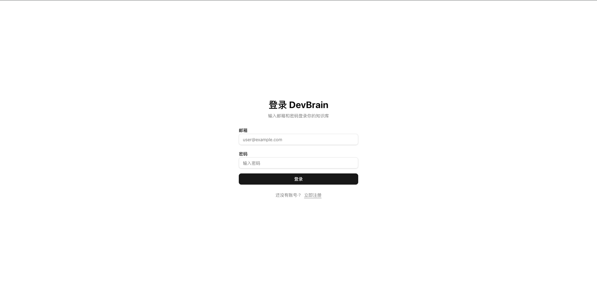
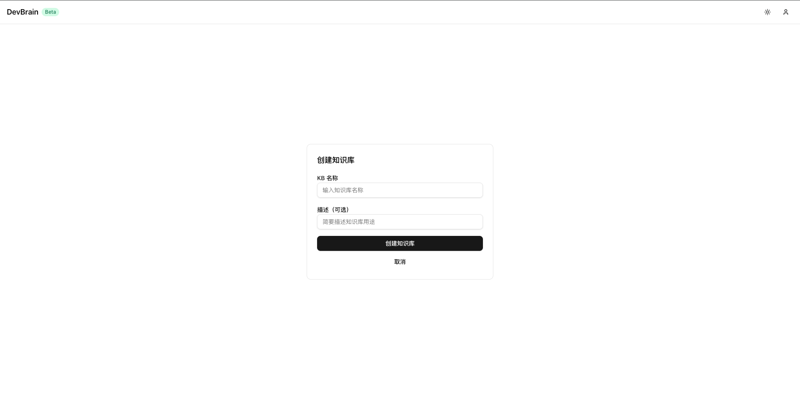
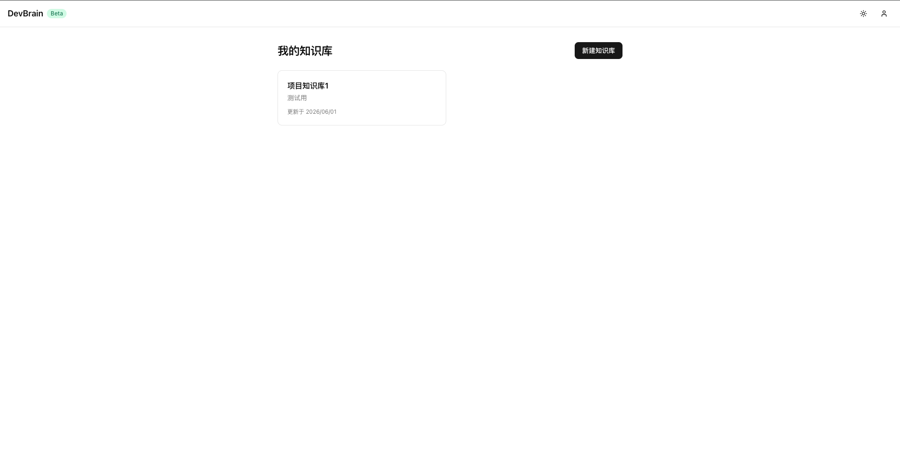
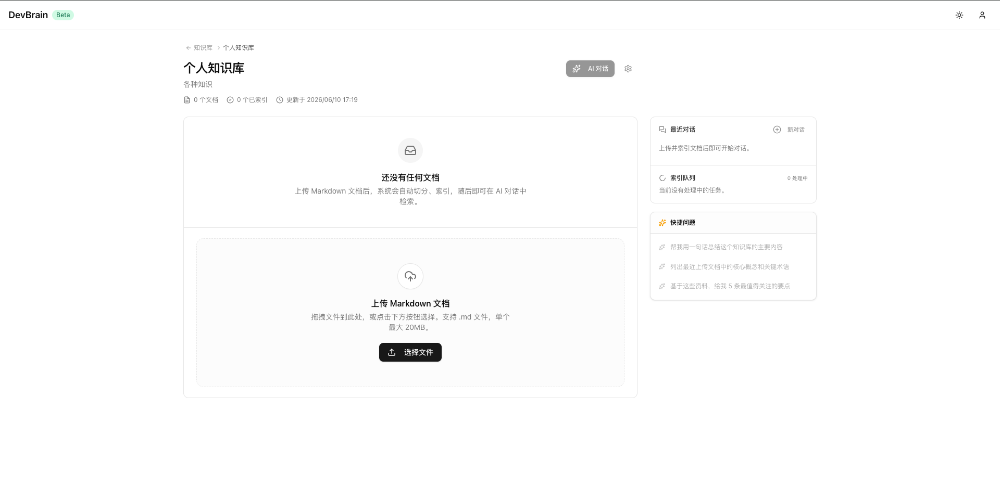
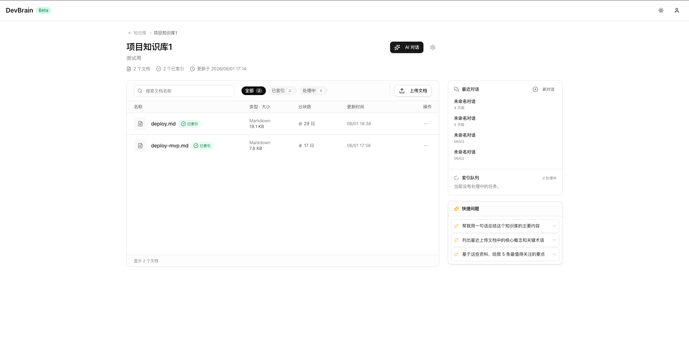
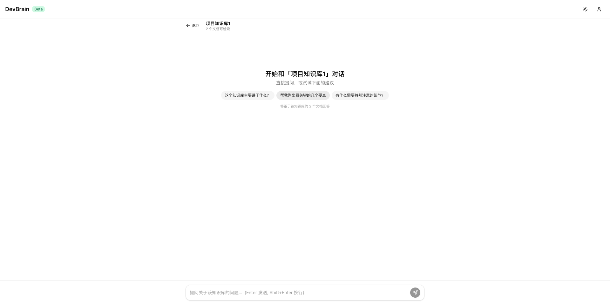
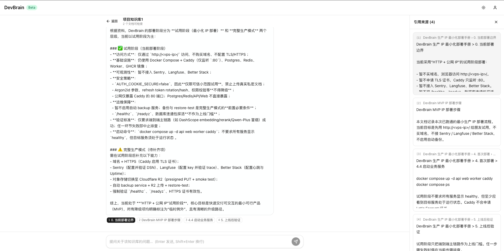
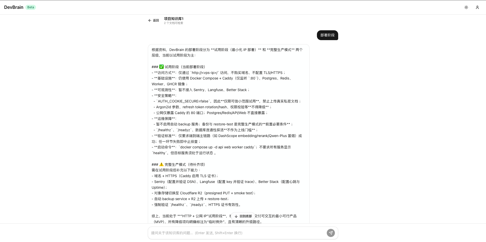
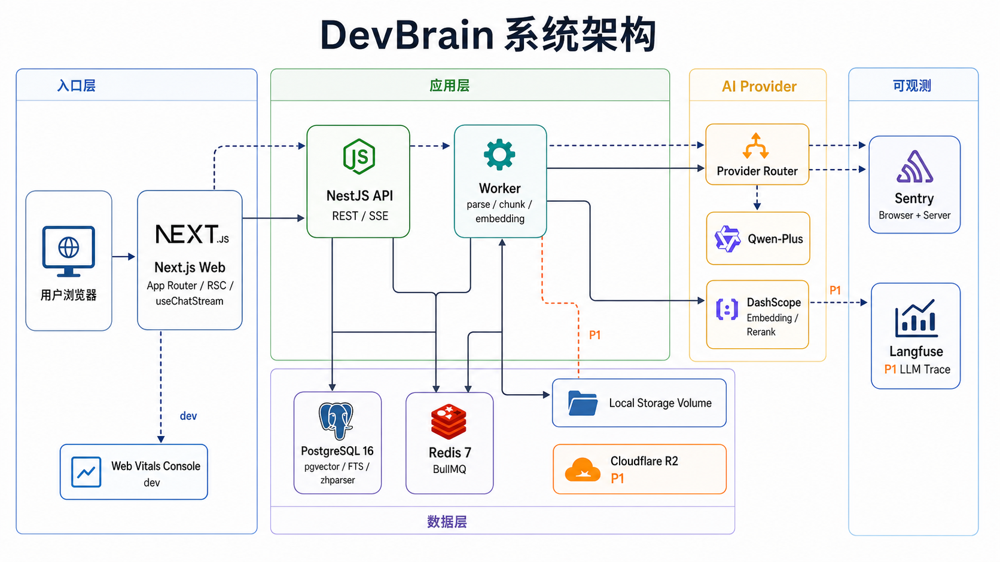

# DevBrain


DevBrain 是一个面向开发者的 self-hostable RAG 知识库。它支持上传技术文档、项目资料和学习笔记，通过混合检索、重排和流式对话生成带引用的回答，帮助用户把分散资料变成可追溯、可验证的问答系统。

## 在线体验

> **<https://mydevbrain.xyz>** — 已部署到 VPS，经 Cloudflare CDN 加速，可直接注册试用。

---

## 项目定位

- 面向开发者个人和小团队的知识库工具。
- 重点解决“资料分散、搜索低效、回答缺少出处”的问题。
- P0 已完成最小可用 RAG 闭环（注册/登录、个人 KB、Markdown 上传、worker 处理、真实检索/生成、流式对话、文本引用定位）以及上线部署链路（Docker Compose、GHCR、VPS pull-by-SHA、Caddy 自动 HTTPS、Cloudflare Free CDN）。
- P1 补齐产品化能力、可观测与备份收尾，以及真实反馈触发的增强功能。

---

## 功能进度

### P0（已完成）

端到端 RAG 闭环：

- [x] 注册、登录、退出，JWT access/refresh + token family rotation。
- [x] 新用户登录后空状态，可直接创建第一个 KB。
- [x] 个人空间下 KB 创建、列表、详情与权限校验。
- [x] Markdown 上传，文档进入状态机；KB 详情页支持拖拽上传。
- [x] Worker 异步执行解析、切块、embedding，不阻塞 API request path。
- [x] PostgreSQL FTS + pgvector 召回 → RRF 融合 → DashScope rerank → 真实 LLM 生成。
- [x] NestJS `text/event-stream` 流式回答；前端消费自定义 JSON SSE 事件。
- [x] 文本 citation 定位到 Markdown chunk anchor 与 source panel。
- [x] 会话软删除；流式终止后刷新最近对话列表并保留已生成内容。

前端性能与体验：

- [x] 受保护段与 auth 段 RSC 静态外壳 + 路由级 Skeleton。
- [x] 客户端 refresh single-flight，受保护页 auth/KB 并行 fetch。
- [x] 双 Caddyfile（dev/prod）：HTML `private,no-cache`，`_next/static`、`_next/image` 走 `immutable`。
- [x] 生产 Caddy 自动 HTTPS + HTTP/2。
- [x] Cloudflare Free CDN 接入（NS、橙云 proxy、SSL Full Strict、Cache Rules）。

部署与工程化：

- [x] Docker Compose 8 服务：postgres、redis、migrate、api、web、worker、caddy、backup。
- [x] GHCR 镜像构建工作流，pull-by-SHA；`check-migrations` 前置 job 拦截 forbidden DROP。
- [x] `pnpm release:vps` VPS 发布脚本，VPS 只 pull 镜像、不构建 Next.js。
- [x] `db:migrate-safe` 受控运行 prisma migrate，防误删 pgvector/FTS 索引。
- [x] husky pre-push 钩子拦截 OpenAPI 漂移（DTO/controller 改动未同步 `openapi.json` / `client/`）。
- [x] API、Web、Postgres、Redis 容器 healthcheck；Caddy `depends_on: service_healthy`。

可观测与备份：

- [x] 浏览器端 Sentry 错误上报 + App Router 路由跳转仪表化。
- [x] API NestJS Sentry 错误上报与可观测性模块（`instrument.ts` 预 init）。
- [x] Web Vitals 开发期 console 采集（TTFB / FCP / LCP / INP）。
- [x] backup 镜像资产：pg_dump + rclone + supercronic。

### P1（待办）

产品化补齐：

- 找回密码、team、多格式文档、完整文档管理、模型设置、完整会话管理。
- 反馈入口与反馈整理，朋友试用 → 反馈触发后续 P1。

上线与可观测：

- Web Vitals 生产 Sentry 上报（distribution metric 或等效 API）。
- Cloudflare `cf-cache-status`、生产 LCP / TTFB / INP、SSE 经 CDN 冒烟与 before/after 证据归档。
- Langfuse LLM trace、Better Stack 日志与可用性监控。
- 自动备份 restore-test 与生产启用。

存储与渲染：

- R2 / S3 兼容对象存储 adapter，替换 local volume，启用 presigned PUT。
- PDF 渲染：引入 `react-pdf` + `customTextRenderer`，落地 Citation Protocol v2 `page / bbox` 跳页高亮。

反馈触发增强：

- 评测、代码搜索、面试题模式、多模型对比、repo ingest、共享链接、移动端优化。
- 完整 P1 候选以 `docs/planning/devbrain-prd.md` 为准。

---

## 界面预览

以下截图按典型使用流程依次排列：注册 → 登录 → 创建知识库 → 浏览知识库 → 上传文档 → 进入详情 → 发起对话 → 查看引用 → 回看历史会话。

### 1. 注册账号

新用户通过邮箱/密码注册，进入个人空间。


### 2. 登录

已有账号登录后进入空状态或最近使用的知识库。



### 3. 创建知识库

在个人空间下新建知识库，作为后续文档与对话的组织单元。



### 4. 知识库列表

查看当前账号下的所有知识库，进入对应空间。



### 5. 上传文档

支持拖拽上传 Markdown 等文档，后台 worker 异步完成解析、切块与 embedding。



### 6. 知识库详情

知识库内汇总文档、文档处理状态与对话入口。



### 7. 发起新会话

在知识库内提问，系统执行混合检索 + rerank 后由 LLM 流式生成回答。



### 8. 查看引用来源

回答中的引用可点击，定位到对应文档 chunk，保证回答可追溯、可验证。



### 9. 历史会话

会话自动归档，可随时回看过往问答与引用记录。



---

## 技术栈

| 层               | 选型                                                                           | 说明                                                                           |
| ---------------- | ------------------------------------------------------------------------------ | ------------------------------------------------------------------------------ |
| 前端             | Next.js 16 App Router、React 19、Tailwind v4、shadcn/ui                        | RSC 静态外壳 + 路由级 Skeleton + 客户端认证恢复                                |
| 状态             | TanStack Query、Zustand、URL state                                             | 服务端数据和纯 UI 状态分层管理                                                 |
| Markdown         | `unified`、`remark-parse`、`remark-gfm`、`mdast-util-to-string`                | Worker 解析 Markdown、切块、生成 anchor；前端展示文本回答与 source panel       |
| 后端             | NestJS 11、REST + SSE、`class-validator`、Swagger/OpenAPI、generated TS client | 模块化 API；DTO/controller 改动通过 husky pre-push 守护 OpenAPI 同步           |
| ORM              | Prisma 6                                                                       | schema-first，便于迁移和类型生成                                               |
| 数据库           | PostgreSQL 16 + pgvector + PG FTS + zhparser                                   | 业务数据、向量和全文检索统一管理；保留 `VectorStore` 抽象                      |
| 缓存/队列        | Redis 7 + BullMQ                                                               | 异步文档处理与任务状态管理                                                     |
| 对象存储         | 本地持久化 volume，API/Worker 共享                                             | R2 / S3 兼容 adapter 与 presigned PUT 在 P1 实现                               |
| LLM 调用         | 自研 provider router + NestJS SSE                                              | 暂未接入 LangChain.js 或 Vercel AI SDK `useChat`，迁移需独立 change            |
| LLM provider     | Qwen-Plus 主路径，DeepSeek / Claude / GPT 作为 fallback 接口                   | 实现位于 `apps/api/src/providers/llm`                                          |
| Embedding/Rerank | DashScope `text-embedding-v4`、`gte-rerank-v2`                                 | 真实 provider smoke 至少手动跑通一次                                           |
| 鉴权             | Argon2id (`m=64MB/t=3/p=4`)、JWT access/refresh、token family rotation         | refresh token 只存 SHA-256，cookie 使用 HttpOnly / Secure / SameSite=Strict    |
| 反向代理         | Caddy 2，双 Caddyfile（dev / prod）                                            | 生产 Caddy 自动 HTTPS + HTTP/2；静态资源 `immutable`，HTML `private, no-cache` |
| 部署             | Docker Compose 8 服务、GHCR pull-by-SHA、`pnpm release:vps`                    | CI 构建镜像；VPS 只拉取镜像并执行 migration                                    |
| CDN              | Cloudflare Free plan（橙云 proxy、SSL Full Strict、Cache Rules）               | 不启用 China Network、不要求 ICP 备案；接入步骤见 `docs/deploy-mvp.md`         |
| 可观测           | Sentry 浏览器端 + App Router 路由跳转、Sentry NestJS、Web Vitals dev console   | Web Vitals 生产上报、Langfuse、Better Stack 在 P1                              |
| 备份             | `pg_dump` + rclone + supercronic                                               | backup 镜像资产已存在；restore-test 与生产启用在 P1                            |

---

## 架构图



---

## 关键设计

### 一个 Postgres 承载业务数据、向量和全文检索

P0 使用 PostgreSQL 16 同时承载业务表、pgvector 向量和 PG FTS。这样可以减少基础设施数量，简化备份恢复和权限控制。代码层保留 `VectorStore` 抽象，后续规模增长后可评估是否重新讨论独立向量库。

### Hybrid Search + RRF + Rerank

初始检索链路：

1. BM25 召回候选。
2. 向量检索召回候选。
3. RRF 融合两路结果。
4. rerank 重排。
5. 选取最终上下文交给 LLM。

BM25 对 API 名、错误码、函数名等精确关键词更敏感；向量检索对语义相近表达更友好。两者融合后再 rerank，可以在工程复杂度可控的前提下提升回答上下文质量。

### Citation Protocol

```ts
type Citation = {
  id: string;
  documentId: string;
  sourceType: 'pdf' | 'markdown' | 'txt' | 'docx';
  chunkId: string;
  chunkText: string;
  score: number;
  page?: number;
  bbox?: { x: number; y: number; width: number; height: number; unit: 'ratio' };
  headingPath?: string[];
  anchor?: string;
};
```

P0 使用 Markdown 文本 citation，依赖 `chunkId + anchor + headingPath` 定位。PDF 的 `page + bbox` 是 Citation Protocol v2 的保留能力，进入 P1 后引入 `react-pdf` 实现 viewer 与跳页高亮。

### LLM 调用边界

- Provider router 由后端自研，集中在 `apps/api/src/providers`，分 `embedding / rerank / llm` 三个子模块。
- Retrieval 与 generation 分别位于 `apps/api/src/retrieval` 和 `apps/api/src/generation`。
- Chat streaming 使用 NestJS `text/event-stream`，前端通过 `apps/web/src/features/chat/use-chat-stream.ts` 消费自定义 JSON SSE 事件。
- LangChain.js 与 Vercel AI SDK `useChat` 暂未接入；若后续要回到原锁定架构，需要独立 change 明确迁移范围和兼容策略。

---

## 项目结构

```text
devbrain/
├── apps/
│   ├── api/                 # NestJS API
│   │   └── src/
│   │       ├── auth/                 # 注册/登录/JWT/token family rotation
│   │       ├── chat/                 # SSE streaming、citation 解析
│   │       ├── documents/            # 文档查询与状态机
│   │       ├── generation/           # prompt 构建与 LLM 调用
│   │       ├── kbs/                  # 知识库 CRUD 与权限
│   │       ├── observability/        # Sentry / 监控基础设施
│   │       ├── providers/            # embedding / rerank / llm provider router
│   │       ├── retrieval/            # BM25 + vector + RRF
│   │       ├── spaces/               # personal space
│   │       ├── storage/              # 本地存储 adapter + presigned 签名
│   │       ├── uploads/              # 文档上传入口
│   │       ├── health/               # /healthz、/readyz
│   │       └── instrument.ts         # Sentry 预 init
│   ├── web/                 # Next.js Web
│   │   └── src/
│   │       ├── app/                  # App Router（auth 段 / 受保护段）
│   │       ├── components/           # ProtectedShell、KbHomeClient、WebVitals 等
│   │       ├── features/
│   │       │   ├── auth/             # 登录/注册/AuthPageShell
│   │       │   ├── chat/             # chat-client、use-chat-stream、source-panel
│   │       │   ├── documents/        # 上传与文档列表
│   │       │   └── kb/               # KB 列表/详情/拖拽上传
│   │       ├── lib/                  # api-fetch（refresh single-flight）等
│   │       ├── stores/               # Zustand stores
│   │       └── providers/            # TanStack Query Provider 等
│   └── worker/              # 文档处理 worker
│       └── src/
│           ├── ingestion/            # Markdown 解析与切块
│           ├── storage/              # worker 端本地存储 adapter
│           └── document.worker.ts    # BullMQ 消费入口
├── packages/
│   └── db/                  # Prisma schema、migration、generated client
├── infra/
│   ├── backup/              # backup 镜像、backup.sh、crontab
│   ├── caddy/               # Caddyfile（dev）、Caddyfile.prod
│   ├── cloudflare/          # Cloudflare 配置归档
│   └── postgres/            # PostgreSQL 16 + pgvector + zhparser 镜像
├── docs/
│   ├── planning/            # 产品需求和开发路线图
│   ├── deploy.md            # 部署总览
│   ├── deploy-mvp.md        # MVP 上线流程（含 Cloudflare 接入与回退）
│   ├── config-domain.md     # 域名配置
│   └── frontend-page-refactor.md
├── openspec/                # OpenSpec changes / specs
├── scripts/
│   ├── release-vps.sh       # VPS 发布脚本（pull-by-SHA）
│   ├── db-migrate-safe.mjs  # 受控运行 prisma migrate dev，防误删 pgvector/FTS 索引
│   └── check-migrations.mjs # CI 前置扫 forbidden DROP，作为 GHCR 构建门槛
├── .github/
│   └── workflows/
│       └── build-and-push.yml  # check-migrations + 多镜像构建并推送 GHCR
├── .husky/
│   └── pre-push             # OpenAPI 漂移检查（DTO/controller 改动必须同步 openapi.json / client/）
├── docker-compose.yml
├── docker-compose.prod.yml
├── .env.example
├── pnpm-workspace.yaml
└── README.md
```

---

## 本地开发

### 前置条件

- Node 22+。
- pnpm 10.x。
- Docker 24+ 和 Docker Compose v2。

### 初始化

```bash
pnpm install
cp .env.example .env
```

### 启动基础依赖

```bash
pnpm dev:infra      # 等价于 docker compose up -d postgres redis
```

### 启动开发服务

```bash
pnpm dev            # 并行启动 db build、API(3001)、Worker，Web(3000) 等 API /readyz 就绪后启动
```

默认端口：

- Web: `http://localhost:3000`
- API: `http://localhost:3001`

### 常用命令

```bash
pnpm lint               # eslint 全仓
pnpm typecheck          # TS 全仓类型检查
pnpm test               # 全仓测试（API: Jest, Web: Vitest, Worker: Jest）
pnpm build              # 全仓 build
pnpm test:e2e           # Web Playwright
pnpm format             # Prettier 写入
pnpm format:check       # Prettier 校验
pnpm check:migrations   # 扫描 forbidden DROP（与 CI 前置同脚本）
docker compose config   # 校验 compose 配置
```

> husky pre-push 钩子会拦截“DTO/controller 改动但 `apps/api/openapi.json` 或 `apps/api/client/` 未同步”的提交，必要时在本地先跑 `pnpm gen:openapi && pnpm gen:client` 再 commit。

Provider smoke 命令：

```bash
pnpm --filter @devbrain/worker smoke:embedding:dashscope
pnpm --filter @devbrain/api smoke:rerank:dashscope
pnpm --filter @devbrain/api smoke:llm:qwen
```

OpenAPI / generated client：

```bash
pnpm gen:openapi
pnpm gen:client
```

VPS 发布：

```bash
pnpm release:vps --dry-run
pnpm release:vps
```

首次部署、域名/CDN 切换与回退预案见 `docs/deploy.md`、`docs/deploy-mvp.md` 和 `docs/config-domain.md`。

---

## P0 验收

- 注册/登录/退出可用。
- 新用户首次登录能看到空状态并创建个人 KB。
- 用户能上传 Markdown，并看到 worker 把文档推进到 `ready` 或 `failed`。
- Markdown 被解析为 chunks、embedding 和 FTS 字段。
- 用户能在 KB 内提问并收到真实 LLM 的流式回答。
- 回答包含文本 citation，点击后能定位到 chunk anchor 或 source panel。
- 本地 E2E 跑通：注册/登录 → 空状态 → 创建 KB → 上传 Markdown → 等待 ready → 提问 → citation 定位。
- 真实 DashScope embedding、DashScope rerank、Qwen-Plus smoke 至少手动跑通一次。

---

## License

MIT
